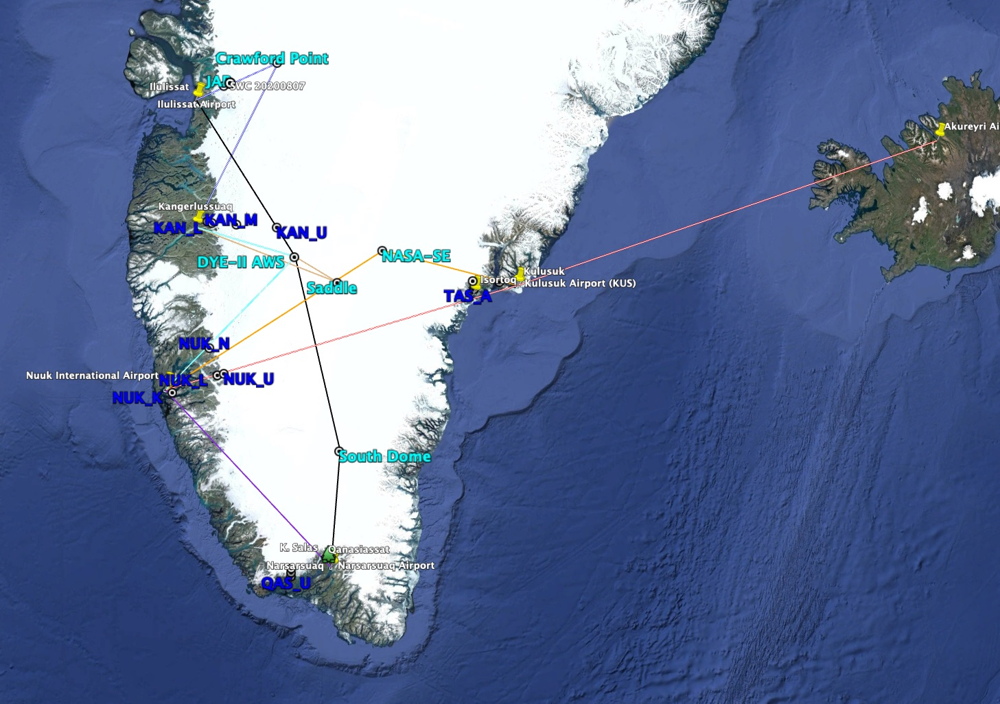

in AWS_maintenance_flight_planner.py the user inserts flight plan data including a campaign name then the following fields:
- calendar date (YYYY-MM-DD)
- start time
- stoppage times
- 3-letter codes of starting and ending locations
- number of passengers (PAX)
- freight not including PAX weights
- work per flight leg including that on the ground

-.csv and Excel versions of a flight plan table that includes

csv outputs:
- calendar dates
- number of flight days from start to end of charter
- distances between 'airports'
- fly times between 'airports' (without taxi and circling)
- day of week, e.g. Monday, Tuesday
- freight
- N PAX
- activities for each flight leg
- adding taxi and circling time
- total fly time not including taxi and circling
    kml Google Earth lines between places

site info:

[list of site names and coordinates](planning_info/all_sites.csv)