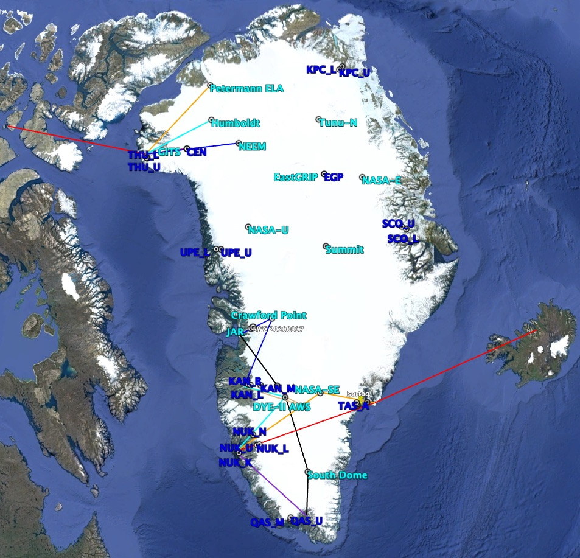

in AWS_maintenance_flight_planner_v2.py the user inserts flight plan data: start time; stop time; 3-letter codes of starting and ending locations.

outputs:
    .csv and Excel versions
    kml Google Earth lines between places

site info:

[list of site names and coordinates](planning_info/all_sites.csv)